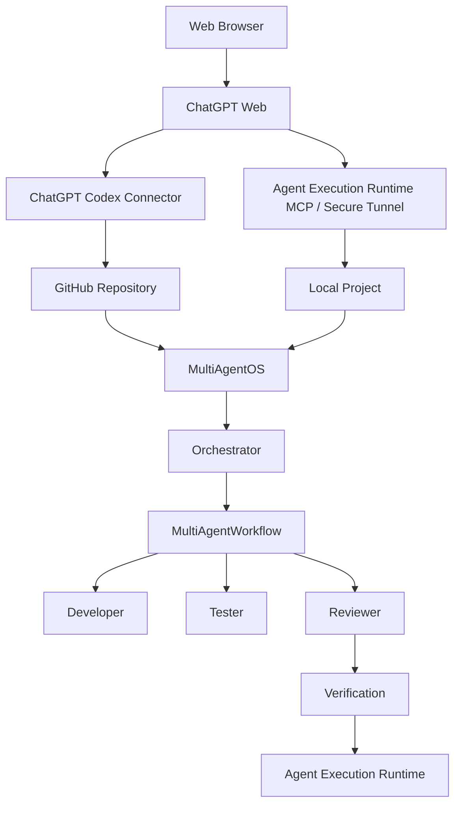
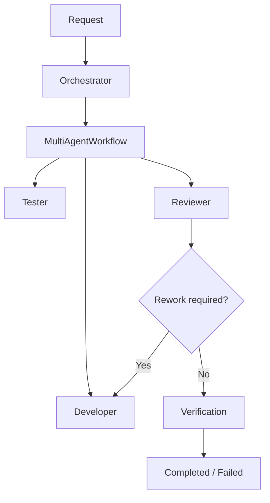
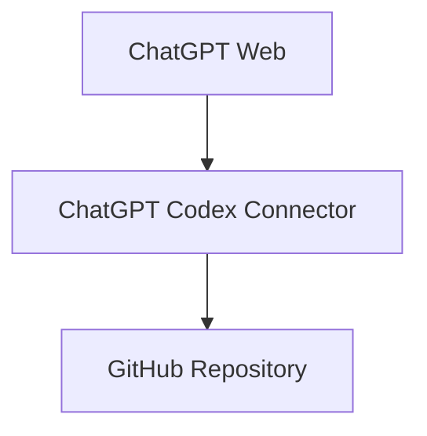

# MultiAgentOS

> **Cost-Free Multi-Agent Development Orchestration**

MultiAgentOSは **Agent Execution Runtime** を中心とするローカルファーストのAI開発オーケストレーション基盤です。

Cost-Freeの基本パスでは、**別途の有料AI API Keyを必要としません。** MultiAgentOSは利用可能なAIクライアント、GitHub、ローカルプロジェクトを連携し、実行権限をAgent Execution Runtimeに保持します。

## MultiAgentOSの役割

MultiAgentOSは**AI協調**と**実行権限**を分離します。

- **ChatGPT Web** — 現在の検証環境でGitHub + ローカルMCPを利用できる開発エントリーポイント
- **ChatGPT Mobile** — 現在の検証環境でGitHubのみ利用できる開発エントリーポイント
- **ChatGPT Codex Connector** — リモートGitHub Repositoryへのアクセス
- **Agent Execution Runtime MCP / Secure Tunnel** — ローカルプロジェクトへの接続
- **Orchestrator** — マルチエージェント協調の全体調整
- **MultiAgentWorkflow** — Developer → Tester → Reviewer
- **Agent Execution Runtime** — 権限と実行の最終境界

Agentは意図・計画・結果を提供しますが、filesystem、process、patch、Gitの実行権限を直接所有しません。

## ChatGPTクライアントの検証範囲

現在のMultiAgentOS開発環境で実際に確認した接続範囲は次のとおりです。

| クライアント | GitHub Repository | ローカルMCP | 状態 |
| --- | --- | --- | --- |
| ChatGPT Web | 利用可能 | 利用可能 | 検証済み |
| ChatGPT Mobile | 利用可能 | 利用不可 | 検証済み |

> 現在の検証環境ではChatGPT WebがGitHubとローカルMCPの両方を利用できます。ChatGPT MobileではGitHub接続のみ利用できます。この表は検証済みの組み合わせを記録するものです。

## アーキテクチャ



### 責任境界

| コンポーネント | 責任 |
| --- | --- |
| **ChatGPT Web** | ユーザーエントリーポイント |
| **ChatGPT Codex Connector** | リモートGitHub Repositoryアクセス |
| **Agent Execution Runtime MCP / Secure Tunnel** | ローカルプロジェクト接続 |
| **MultiAgentOS** | Agent契約、ルーティング、状態、オーケストレーション |
| **Orchestrator** | 全体の協調調整 |
| **MultiAgentWorkflow** | stage、handoff、review、reworkの意味論 |
| **Agent Execution Runtime** | 権限と実行の制御 |

## マルチエージェントワークフロー



`Orchestrator.run_workflow()` が安定した上位オーケストレーション入口です。`MultiAgentWorkflow` が具体的なstage、handoff、review、reworkの意味論を管理し、`MultiAgentRuntime` はアプリケーション/runtime adapterとしてこの境界を利用します。

Agent Execution Runtimeはpermission、filesystem、patch、process、Git、verificationを担当する実行境界です。

## 接続モデル

### リモートGitHub path



### ローカルプロジェクト path

```text
ChatGPT Web
    |
    v
Agent Execution Runtime MCP / Secure Tunnel
    |
    v
Agent Execution Runtime
    |
    v
Local Project
```

Agent Execution Runtimeには**1つのMCP Server**だけがあります。Secure MCP Tunnelと`tunnel-client`はtransport/connection infrastructureであり、別のMCP Serverではありません。

ローカルAgent Execution Runtime MCP ServerはOpenAI、ChatGPT、tunnel、または有料AI API Keyなしでも独立して利用できます。

## 用語体系

**Agent Execution Runtime**をローカル実行・権限境界の正式な説明名称として使用します。

## Cost-Free baseline

基本ランタイムのポイントは明確です。

> **MultiAgentOSのCost-Free基本パスには別途の有料AI API Keyを必要としません。**

さらに、次も基本的には必要ありません。

- 別途のAgent APIサブスクリプション
- MultiAgentOS SaaSサブスクリプション
- Tunnel用の2つ目のMCP Server

ただし、利用するAIサービスのプランおよび使用量制限は適用されます。Cost-FreeはMultiAgentOSのランタイムコスト構造を示すもので、AIサービスの無制限利用を意味しません。

### 検証済みの基本機能

- Agent Execution Runtime MCP stdio initialize / tool discovery
- filesystem READ / WRITE
- `patch.apply`
- `shell.run`
- local MCP/runtime tests
- runtime health/readiness
- Secure MCP Tunnel readiness

詳細は [Cost-Free Development Baseline](docs/COSTFREE_DEVELOPMENT.md) を参照してください。

## クイックスタート

### インストール

```bash
python -m pip install multiagentos
```

### プロジェクト初期化

```bash
cd your-project
multiagentos init . --component all
multiagentos status .
```

### ローカルタスク実行

```bash
multiagentos run --path . --objective "run tests" -- python -m unittest discover -s tests -v
```

### Chat Agentセッション開始

```bash
multiagentos chat --path . --objective "inspect the current project"
```

### Agent Execution Runtime MCP Server起動

```bash
multiagentos mcp serve --path .
```

## 設定

プロジェクト設定は`.multiagentos/`に保存されます。

初期化では次のファイルをインストールできます。

- `components.json` — 選択したcomponent
- `execution.json` — execution Agent/Model選択
- `chat.json` — Chat Agent選択
- `agents.json` — multi-agent catalog
- `state/` および必要なsession/checkpointデータ

Credentialとprovider API keyはプロジェクト設定に保存されません。

## 検証

```bash
python -m unittest discover -s tests -v
```

GitHub ActionsでもリポジトリのCIを検証します。

## ドキュメント

- [Getting Started](docs/GETTING_STARTED.md)
- [Cost-Free Development Baseline](docs/COSTFREE_DEVELOPMENT.md)
- [ChatGPT Client Capability Matrix](docs/CHATGPT_CLIENT_CAPABILITIES.md)
- [Agent Execution Runtime Connection Guide](docs/AGENT_EXECUTION_RUNTIME_CONNECTIONS.md)
- [Secure MCP Tunnel Setup](docs/MCP_TUNNEL.md)
- [Agent Execution Runtime GitHub Connection](docs/AGENT_EXECUTION_RUNTIME_GITHUB_CONNECTION.md)
- [Agent Execution Runtime MCP Architecture](docs/ARCHITECTURE_DECISIONS.md)

英語READMEをcanonical technical documentとして維持し、各locale READMEも同じアーキテクチャ、用語、Cost-Free基本パスを維持します。

**[한국어](README.ko.md) · [English](README.md) · [简体中文](README.zh-CN.md)**

## License

[LICENSE](LICENSE)を参照してください。
