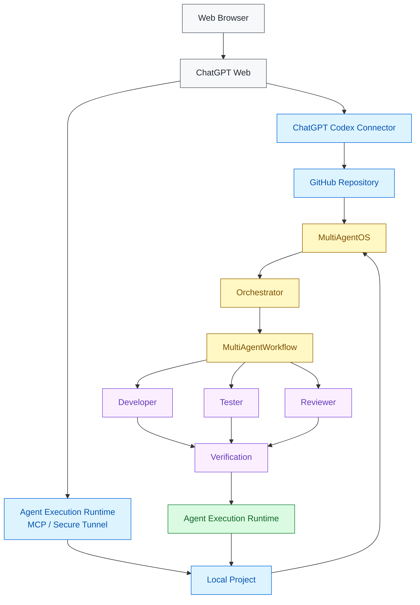
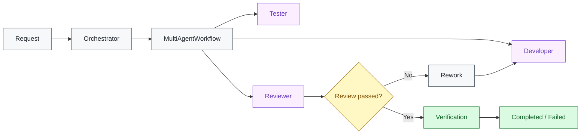
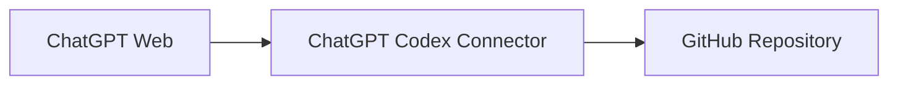
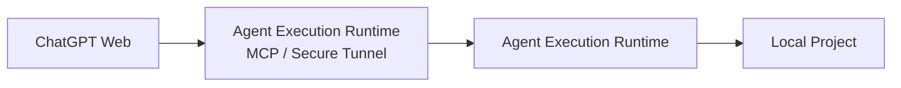

# MultiAgentOS

> **Cost-Free Multi-Agent Development Orchestration**

MultiAgentOS is a local-first development orchestration platform built around **Agent Execution Runtime**.

The cost-free baseline does **not require a separate paid AI API key**. MultiAgentOS connects an already-available AI client with GitHub and a local project while keeping execution authority inside Agent Execution Runtime.

## Why MultiAgentOS

MultiAgentOS separates **AI collaboration** from **execution authority**.

- **ChatGPT Web** — single user-facing entry point
- **ChatGPT Codex Connector** — remote GitHub repository access
- **Agent Execution Runtime MCP / Secure Tunnel** — local project access
- **Orchestrator** — top-level multi-agent coordination
- **MultiAgentWorkflow** — concrete Developer → Tester → Reviewer execution
- **Agent Execution Runtime** — permission and execution authority

Agents provide intent, plans, and results. They do not directly own filesystem, process, patch, or Git execution authority.

## Architecture

The main architecture is rendered as a native GitHub Mermaid diagram so the repository overview is visual without maintaining a separate generated image. GitHub supports Mermaid directly in Markdown files. citeturn0search0turn0search1



### Responsibility boundaries

| Component | Responsibility |
| --- | --- |
| **ChatGPT Web** | User-facing entry point |
| **ChatGPT Codex Connector** | Remote GitHub repository access |
| **Agent Execution Runtime MCP / Secure Tunnel** | Local project connection |
| **MultiAgentOS** | Agent contracts, routing, state, and orchestration |
| **Orchestrator** | Overall collaboration coordination |
| **MultiAgentWorkflow** | Stage, handoff, review, and rework semantics |
| **Agent Execution Runtime** | Permission and execution authority |

## Multi-agent workflow



`Orchestrator.run_workflow()` is the stable higher-level orchestration entry point. `MultiAgentWorkflow` owns the concrete stage, handoff, review, and rework semantics. `MultiAgentRuntime` remains an application/runtime adapter and delegates execution to the orchestration boundary.

Agent Execution Runtime remains the execution boundary for permissions, filesystem access, patch application, process execution, Git operations, and verification.

## Connection model

### Remote GitHub path



This path addresses the remote repository and its durable GitHub state.

### Local project path



Agent Execution Runtime has **one MCP Server**. Secure MCP Tunnel and `tunnel-client` are transport/connection infrastructure, not another MCP server.

The local Agent Execution Runtime MCP server can be used independently without OpenAI, ChatGPT, a tunnel, or a paid AI API key.

## Terminology

**Agent Execution Runtime** is the descriptive architectural name for the local execution and permission boundary.

## Cost-Free baseline

The core positioning is simple:

> **No separate paid AI API key is required for the MultiAgentOS cost-free baseline.**

The baseline also does not require:

- a separate agent API subscription
- a MultiAgentOS SaaS subscription
- a second MCP server for the tunnel path

AI-client/product plan limits still apply to the AI service you choose to use. “Cost-Free” describes the MultiAgentOS runtime architecture; it does not mean unlimited AI-service usage.

### Verified baseline capabilities

- Agent Execution Runtime MCP stdio initialization and tool discovery
- filesystem READ / WRITE
- `patch.apply`
- `shell.run`
- local MCP/runtime tests
- runtime health/readiness
- Secure MCP Tunnel readiness

See [Cost-Free Development Baseline](docs/COSTFREE_DEVELOPMENT.md) for the verification record.

## Quick start

### Install

```bash
python3 -m pip install multiagentos
```

**[Download files on PyPI](https://pypi.org/project/multiagentos/#files)**

## Initialize a project

```bash
cd your-project
multiagentos init . --component all
multiagentos status .
```

### Run a local task

```bash
multiagentos run --path . --objective "run tests" -- python -m unittest discover -s tests -v
```

### Start a Chat Agent session

```bash
multiagentos chat --path . --objective "inspect the current project"
```

### Expose the Agent Execution Runtime MCP server

```bash
multiagentos mcp serve --path .
```

For explicit filesystem writes and process execution:

```bash
multiagentos mcp serve \
  --path . \
  --allow-write \
  --allow-process
```

## Configuration

Project configuration is stored under `.multiagentos/`.

The initializer can install:

- `components.json` — selected components
- `execution.json` — execution Agent/Model selection
- `chat.json` — Chat Agent selection
- `agents.json` — multi-agent catalog
- `state/` and session/checkpoint data as applicable

Credentials and provider API keys are not written to project configuration.

## Validation

Run the local test suite:

```bash
python -m unittest discover -s tests -v
```

GitHub Actions validates the repository through CI.

## Documentation

- [Getting Started](docs/GETTING_STARTED.md)
- [Cost-Free Development Baseline](docs/COSTFREE_DEVELOPMENT.md)
- [Agent Execution Runtime Connection Guide](docs/AGENT_EXECUTION_RUNTIME_CONNECTIONS.md)
- [Secure MCP Tunnel Setup](docs/MCP_TUNNEL.md)
- [macOS MCP Service](docs/MACOS_MCP_SERVICE.md)
- [macOS tunnel-client Service](docs/MACOS_TUNNEL_SERVICE.md)
- [Agent Execution Runtime GitHub Connection](docs/AGENT_EXECUTION_RUNTIME_GITHUB_CONNECTION.md)
- [Agent Execution Runtime MCP Architecture](docs/ARCHITECTURE_DECISIONS.md)
- [Agent Plugin Marketplace](docs/PLUGIN_MARKETPLACE.md)

The English README is the canonical technical document. Localized READMEs preserve the same architecture, terminology, and cost-free baseline.

**[한국어](README.ko.md) · [日本語](README.ja.md) · [简体中文](README.zh-CN.md)**

## License

See [LICENSE](LICENSE).
