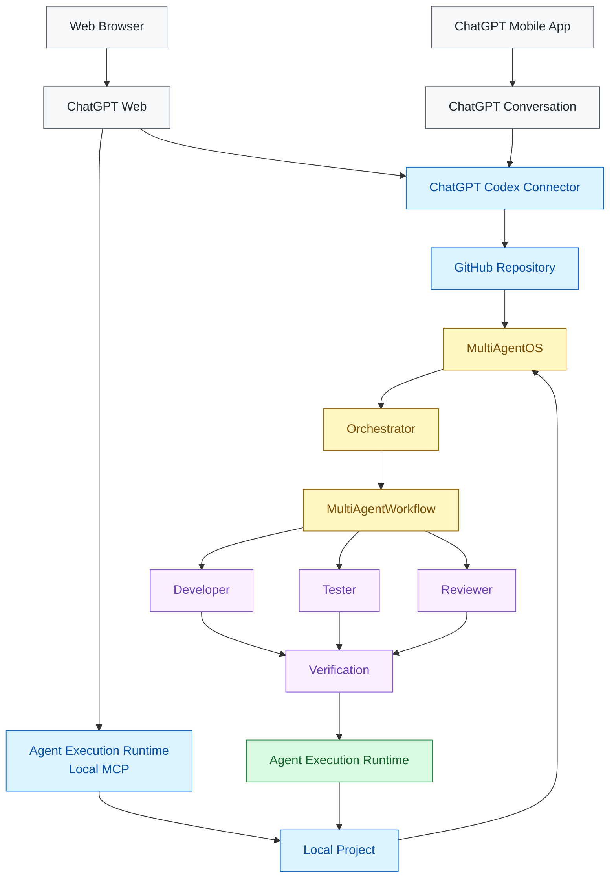
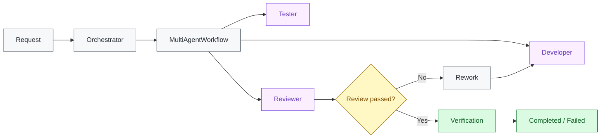
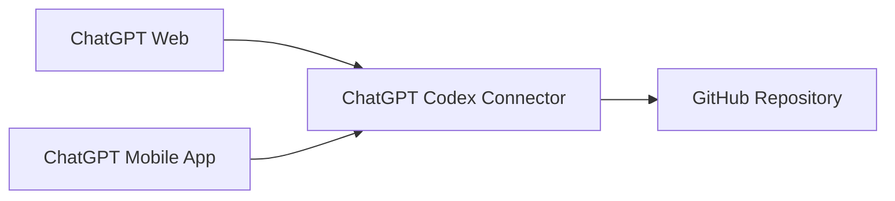

# MultiAgentOS

> **Cost-Free Multi-Agent Development Orchestration**

MultiAgentOS is a local-first development orchestration platform built around **Agent Execution Runtime**.

The cost-free baseline does **not require a separate paid AI API key**. MultiAgentOS connects an already-available AI client with GitHub and a local project while keeping execution authority inside Agent Execution Runtime.

## Why MultiAgentOS

MultiAgentOS separates **AI collaboration** from **execution authority**.

- **ChatGPT Web** — verified entry point for GitHub + local MCP development in the current setup
- **ChatGPT Mobile App** — verified GitHub-only development entry point in the current setup
- **ChatGPT Codex Connector** — remote GitHub repository access
- **Agent Execution Runtime MCP** — local project access
- **Orchestrator** — top-level multi-agent coordination
- **MultiAgentWorkflow** — concrete Developer → Tester → Reviewer execution
- **Agent Execution Runtime** — permission and execution authority

The same MultiAgentOS architecture can be used from ChatGPT Web for both GitHub and local MCP work. In the verified setup, the ChatGPT mobile app is limited to the GitHub path; local MCP is not available there.

Agents provide intent, plans, and results. They do not directly own filesystem, process, patch, or Git execution authority.

## Architecture

The main architecture is rendered as a native GitHub Mermaid diagram so the repository overview is visual without maintaining a separate generated image. GitHub supports Mermaid directly in Markdown files.



### Verified ChatGPT client capability

The following matrix records the capability observed in the current MultiAgentOS development environment. It is intentionally a runtime/client compatibility record, not a promise that every ChatGPT account or product configuration exposes the same integrations.

| Client | GitHub repository access | Local MCP / local project access | Verified status |
| --- | --- | --- | --- |
| **ChatGPT Web** | Yes | Yes | **Verified** |
| **ChatGPT Mobile App** | Yes | No | **Verified** |
| **ChatGPT Desktop** | Not evaluated | Not evaluated | Out of current release scope |

**Important:** ChatGPT Web is currently the full development entry point for this setup: it can work with both the remote GitHub repository and the local MultiAgentOS MCP service. The ChatGPT mobile app can use the GitHub connection, but local MCP access is not available in the verified setup.

This distinction is a client-capability boundary. It does not change the MultiAgentOS local MCP architecture or the cost-free baseline.

### Connect the ChatGPT Codex Connector to your GitHub repository

MultiAgentOS uses the **ChatGPT Codex Connector** for the remote GitHub repository path. GitHub must be connected to the ChatGPT account, and the specific repository must be authorized for access. urlOpenAI: Connecting GitHub to ChatGPThttps://help.openai.com/en/articles/11145903-connecting-github-to-chatgpt

1. Open **ChatGPT Settings** and open **Apps / Plugins** (the exact menu name depends on the ChatGPT client).
2. Open the **ChatGPT Codex Connector / GitHub connection** and start the connection flow.
3. Sign in to GitHub when prompted and authorize the ChatGPT app.
4. In GitHub's repository access settings, select the repositories that the ChatGPT Codex Connector is allowed to access.
5. Return to ChatGPT and open a supported conversation.
6. Search for or select the authorized repository when using the ChatGPT Codex Connector.

> **Repository access is separate from local MCP access.** Connecting the ChatGPT Codex Connector gives ChatGPT access to the authorized remote repository. The Agent Execution Runtime MCP / Secure Tunnel is the separate path used for local project execution.

If a newly authorized repository does not appear immediately, allow a few minutes for it to become available. GitHub organization policies may also require administrator approval. urlOpenAI GitHub connection troubleshootinghttps://help.openai.com/ko-kr/articles/11145903-connecting-github-to-chatgpt

### Responsibility boundaries

| Component | Responsibility |
| --- | --- |
| **ChatGPT Web** | Full verified user-facing development entry point: GitHub + local MCP |
| **ChatGPT Mobile App** | Verified GitHub-only user-facing entry point |
| **ChatGPT Codex Connector** | Remote GitHub repository access |
| **Agent Execution Runtime MCP** | Local project connection |
| **Secure MCP Tunnel** | Optional remote transport for clients that cannot directly reach the local MCP server |
| **MultiAgentOS** | Agent contracts, routing, state, and orchestration |
| **Orchestrator** | Overall collaboration coordination |
| **MultiAgentWorkflow** | Stage, handoff, review, and rework semantics |
| **Agent Execution Runtime** | Permission and execution authority |

## Multi-agent workflow



`Orchestrator.run_workflow()` is the stable higher-level orchestration entry point. `MultiAgentWorkflow` owns the concrete stage, handoff, review, and rework semantics. `MultiAgentRuntime` remains an application/runtime adapter and delegates execution to the orchestration boundary.

Agent Execution Runtime remains the execution boundary for permissions, filesystem access, patch application, process execution, Git operations, and verification.

## Connection model

### Remote GitHub path



This path addresses the remote repository and its durable GitHub state.

### Local project path

```text
ChatGPT Web / Local AI client
      |
      v
127.0.0.1:8000/mcp
      |
      v
MultiAgentOS MCP
      |
      v
Local Project
```

The local Agent Execution Runtime MCP server is the default development path. In the verified setup, ChatGPT Web can reach this local MCP service while the ChatGPT mobile app cannot. Local MCP clients can also use it directly. The service runs on loopback and does not require a paid AI API key or Secure MCP Tunnel.

Secure MCP Tunnel is an optional remote-connection layer for clients that need to reach a private local MCP server from outside the machine. It is not required for the cost-free local MCP baseline.

## Terminology

**Agent Execution Runtime** is the descriptive architectural name for the local execution and permission boundary.

## Cost-Free baseline

The core positioning is simple:

> **No separate paid AI API key is required for the MultiAgentOS cost-free baseline.**

The baseline also does not require:

- a separate agent API subscription
- a MultiAgentOS SaaS subscription
- a second MCP server for the tunnel path

AI-client/product plan limits still apply to the AI service you choose to use. “Cost-Free” describes the MultiAgentOS runtime architecture; it does not mean unlimited AI-service usage.

### Verified baseline capabilities

- Agent Execution Runtime MCP stdio initialization and tool discovery
- filesystem READ / WRITE
- `patch.apply`
- `shell.run`
- local MCP/runtime tests
- runtime health/readiness
- Secure MCP Tunnel readiness

See [Cost-Free Development Baseline](docs/COSTFREE_DEVELOPMENT.md) for the verification record.

## Quick start

### Install

For the local Streamable HTTP MCP server:

```bash
python3 -m pip install "multiagentos[mcp-http]"
```

This installs the MCP HTTP dependencies and the `multiagentos` CLI. No OpenAI API key is required.

**[Download files on PyPI](https://pypi.org/project/multiagentos/#files)**

## Initialize a project

```bash
cd your-project
multiagentos init . --component all
multiagentos status .
```

### Run a local task

```bash
multiagentos run --path . --objective "run tests" -- python -m unittest discover -s tests -v
```

### Start a Chat Agent session

```bash
multiagentos chat --path . --objective "inspect the current project"
```

### Run the local MCP server

For the local read-only baseline:

```bash
multiagentos mcp serve-http --path .
```

For the local read/write workflow:

```bash
multiagentos mcp serve-http \
  --path . \
  --allow-write
```

Install it once as a macOS user service so it starts at login and is restarted by `launchd` after reboot:

```bash
multiagentos mcp install --path . --allow-write
```

Check or remove the service with:

```bash
multiagentos mcp status
multiagentos mcp uninstall
```

The managed service listens only on `127.0.0.1:8000` and keeps its logs under `.multiagentos/logs/`.

## Configuration

Project configuration is stored under `.multiagentos/`.

The initializer can install:

- `components.json` — selected components
- `execution.json` — execution Agent/Model selection
- `chat.json` — Chat Agent selection
- `agents.json` — multi-agent catalog
- `state/` and session/checkpoint data as applicable

Credentials and provider API keys are not written to project configuration.

## Validation

Run the local test suite:

```bash
python -m unittest discover -s tests -v
```

GitHub Actions validates the repository through CI.

## Documentation

- [Getting Started](docs/GETTING_STARTED.md)
- [Cost-Free Development Baseline](docs/COSTFREE_DEVELOPMENT.md)
- [Agent Execution Runtime Connection Guide](docs/AGENT_EXECUTION_RUNTIME_CONNECTIONS.md)
- [Secure MCP Tunnel Setup (optional)](docs/MCP_TUNNEL.md)
- [macOS MCP Service](docs/MACOS_MCP_SERVICE.md)
- [macOS tunnel-client Service (optional)](docs/MACOS_TUNNEL_SERVICE.md)
- [Agent Execution Runtime GitHub Connection](docs/AGENT_EXECUTION_RUNTIME_GITHUB_CONNECTION.md)
- [Agent Execution Runtime MCP Architecture](docs/ARCHITECTURE_DECISIONS.md)
- [Agent Plugin Marketplace](docs/PLUGIN_MARKETPLACE.md)

The English README is the canonical technical document. Localized READMEs preserve the same architecture, terminology, and cost-free baseline.

**[한국어](README.ko.md) · [日本語](README.ja.md) · [简体中文](README.zh-CN.md)**

## License

See [LICENSE](LICENSE).
