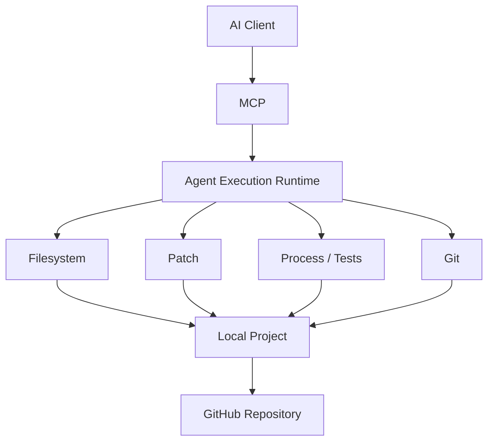
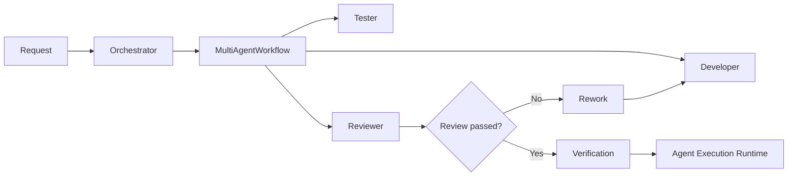

# MultiAgentOS

> **Local-first, GitHub-native Agent Execution Runtime**

Build, inspect, patch, test, and operate real software projects through an AI-native execution boundary.

MultiAgentOS connects an AI client to a real project workspace while keeping **filesystem, patch, process, Git, and verification authority inside the Agent Execution Runtime**.

> **Cost-Free Baseline:** MultiAgentOS does not require a separate paid AI API key to install and operate its local runtime.

---

## Why MultiAgentOS?

AI clients provide reasoning, intent, plans, and results.

**MultiAgentOS provides the execution boundary.**

```text
AI Client
    │
    ▼
MCP
    │
    ▼
┌──────────────────────────────────────┐
│       Agent Execution Runtime        │
│                                      │
│  Filesystem   Patch   Process   Git  │
└──────────────────┬───────────────────┘
                   │
                   ▼
             Real Project
                   │
                   ▼
              GitHub Repo
```

This separation makes local project execution explicit, inspectable, and policy-controlled instead of giving an AI client unrestricted operating-system access.

---

## Core Capabilities

| Capability | What it provides |
| --- | --- |
| **Agent Execution Runtime** | Durable execution and permission boundary for real project work |
| **MCP** | Standard AI-to-runtime tool interface |
| **Filesystem** | Project file READ / WRITE |
| **Patch** | Structured source changes through `patch.apply` |
| **Process** | Controlled commands, tests, and verification |
| **Git** | Repository-aware development operations |
| **GitHub** | Remote repository and collaboration workflow |
| **Project Isolation** | Independent MCP services and lifecycle per project |
| **Secure MCP Tunnel** | Optional remote transport for supported clients |

Write and process capabilities are explicit opt-ins. The default MCP surface is read-only.

---

## Architecture

### Local-first execution



The local MCP server remains on loopback. The AI client does not receive unrestricted operating-system access; execution is mediated by the runtime policy.

### Multi-agent execution



`Orchestrator.run_workflow()` is the higher-level orchestration entry point. `MultiAgentWorkflow` owns stage, handoff, review, and rework semantics.

The runtime remains the authority for permissions and execution.

---

## GitHub + Local Project

MultiAgentOS treats the remote repository and the local working tree as complementary development surfaces.

```text
                    AI Client
                   /         \
                  /           \
                 ▼             ▼
        GitHub Repository   Local MCP
                                │
                                ▼
                    Agent Execution Runtime
                                │
                                ▼
                         Local Project
```

The GitHub path provides durable repository state.

The local MCP path provides controlled access to the actual working tree.

These are separate capabilities and can be used independently.

---

## ChatGPT Web in the Verified Setup

The current development environment has verified the following client boundary:

| Client | GitHub | Local MultiAgentOS MCP | Status |
| --- | --- | --- | --- |
| **ChatGPT Web** | Yes | Yes | **Verified** |
| **ChatGPT Mobile App** | Yes | No | **Verified** |
| **ChatGPT Desktop** | Not evaluated | Not evaluated | Outside current scope |

This is a compatibility record for the verified environment, **not a universal guarantee for every ChatGPT account, plan, or future client build**.

The cost-free local workflow does not depend on Secure MCP Tunnel:

```text
ChatGPT Web
   ├── GitHub connection ──► GitHub Repository
   │
   └── Local MCP ──────────► 127.0.0.1:8000/mcp
                                  │
                                  ▼
                           Local Project
```

---

## Secure MCP Tunnel

Secure MCP Tunnel is an **optional remote connectivity layer** for supported clients that need to reach a private local MCP server.

```text
Supported Remote Client
          │
          ▼
OpenAI Secure MCP Tunnel
          │
          ▼
     tunnel-client
          │
          ▼
MultiAgentOS MCP
          │
          ▼
Agent Execution Runtime
          │
          ▼
     Local Project
```

The local MCP server can remain loopback-only. The tunnel client establishes the outbound connection.

### Important boundary

A healthy tunnel proves that the **tunnel infrastructure is connected**. It does not by itself prove that a particular ChatGPT account or plan can invoke every MCP capability.

For the current cost-free baseline:

| Layer | State |
| --- | --- |
| Agent Execution Runtime | **PASS** |
| Local MCP | **PASS** |
| Secure MCP Tunnel lifecycle | **READY** |
| Control-plane polling | **PASS** |
| ChatGPT hosted remote MCP write | **Plan-gated / not part of baseline acceptance** |

Do not treat the optional hosted tunnel path as a prerequisite for local development.

See [Secure MCP Tunnel Setup](docs/MCP_TUNNEL.md).

---

## Project-Scoped Runtime

Multiple projects can run independently.

```text
Project A                         Project B
─────────                         ─────────
MCP Service                       MCP Service
Runtime                           Runtime
Tunnel (optional)                 Tunnel (optional)
Logs                              Logs
Permissions                       Permissions
```

Each managed project receives its own service identity derived from its resolved project path.

Example:

```bash
multiagentos mcp install \
  --path /absolute/path/to/project1 \
  --port 8000 \
  --allow-write

multiagentos mcp install \
  --path /absolute/path/to/project2 \
  --port 8001 \
  --allow-write
```

Inspect or remove a project-scoped service:

```bash
multiagentos mcp status --path /absolute/path/to/project1
multiagentos mcp uninstall --path /absolute/path/to/project1
```

Supported OS-native lifecycle management includes:

- macOS: per-user `launchd`
- Windows: per-user Task Scheduler

---

## Cost-Free Development Baseline

The core rule is simple:

> **No separate paid AI API key is required for the MultiAgentOS local runtime baseline.**

The baseline is designed around:

```text
Install MultiAgentOS
        │
        ▼
Initialize project
        │
        ▼
Agent Execution Runtime MCP
        │
        ▼
AI Client
   ┌────┼────┬─────┐
   ▼    ▼    ▼     ▼
 READ  PATCH TEST  VERIFY
   │    │    │     │
   └────┴────┴─────┘
          │
          ▼
      GitHub
```

“Cost-Free” describes the **MultiAgentOS runtime architecture**. It does not mean that an AI product has unlimited usage or that every optional AI service is free.

Paid AI providers remain optional.

See [Cost-Free Development Baseline](docs/COSTFREE_DEVELOPMENT.md).

---

## Quick Start

### Install

For the Streamable HTTP MCP server:

```bash
python3 -m pip install "multiagentos[mcp-http]"
```

No OpenAI API key is required for the local runtime.

### Initialize a project

```bash
cd your-project
multiagentos init . --component all
multiagentos status .
```

### Run a task

```bash
multiagentos run \
  --path . \
  --objective "run tests" \
  -- python -m unittest discover -s tests -v
```

### Start a Chat Agent session

```bash
multiagentos chat \
  --path . \
  --objective "inspect the current project"
```

### Start local MCP

Read-only:

```bash
multiagentos mcp serve-http --path .
```

Read/write:

```bash
multiagentos mcp serve-http \
  --path . \
  --allow-write
```

The default endpoint is:

```text
http://127.0.0.1:8000/mcp
```

### Install as a persistent macOS service

```bash
multiagentos mcp install --path . --allow-write
multiagentos mcp status --path .
```

The service is managed by `launchd` and can survive login/reboot.

---

## Configuration

Project configuration lives under:

```text
.multiagentos/
├── components.json
├── execution.json
├── chat.json
├── agents.json
└── state/
```

Credentials and provider API keys are not written into project configuration.

---

## Verification

### MultiAgentOS v0.4.3

The current release verification includes:

- **309 tests passed**
- **3 tests skipped on macOS**
- macOS managed MCP service verified after reboot/login
- Project-scoped Secure MCP Tunnel lifecycle verified
- Tunnel-client control-plane polling verified
- Python wheel and source distribution build verified
- Native release artifacts published
- Local Agent Execution Runtime filesystem READ / WRITE verified
- `patch.apply` verified with filesystem readback
- `shell.run` verified
- GitHub-connected development path verified

### Verification boundary

The repository deliberately distinguishes:

```text
LOCAL RUNTIME VERIFICATION
        │
        ├── MCP
        ├── filesystem
        ├── patch
        ├── process
        └── GitHub
              │
              ▼
          VERIFIED

OPTIONAL HOSTED TUNNEL
        │
        ├── tunnel lifecycle
        ├── control-plane polling
        └── remote client capability
              │
              ▼
     Environment / plan dependent
```

This prevents a healthy tunnel from being incorrectly reported as proof of a hosted client-side MCP tool invocation.

---

## Security and Permission Model

MultiAgentOS keeps execution authority behind an explicit runtime boundary.

```text
AI Intent
   │
   ▼
MCP Tool Request
   │
   ▼
Execution Policy
   │
   ├── filesystem.read
   ├── filesystem.write
   ├── patch.apply
   └── process / shell
   │
   ▼
Real Project
```

Write and process capabilities require explicit opt-in.

For the tunnel path, keep credentials separated:

```text
CONTROL_PLANE_TUNNEL_ID
    → identifies the tunnel

CONTROL_PLANE_API_KEY
    → runtime credential used by tunnel-client

OPENAI_ADMIN_KEY
    → tunnel administration only
```

Do not place an administration key in a long-lived runtime configuration.

---

## Documentation

- [Getting Started](docs/GETTING_STARTED.md)
- [Cost-Free Development Baseline](docs/COSTFREE_DEVELOPMENT.md)
- [ChatGPT Client Capability Matrix](docs/CHATGPT_CLIENT_CAPABILITIES.md)
- [Agent Execution Runtime Connection Guide](docs/AGENT_EXECUTION_RUNTIME_CONNECTIONS.md)
- [Secure MCP Tunnel Setup](docs/MCP_TUNNEL.md)
- [macOS MCP Service](docs/MACOS_MCP_SERVICE.md)
- [macOS Tunnel Service](docs/MACOS_TUNNEL_SERVICE.md)
- [Agent Execution Runtime GitHub Connection](docs/AGENT_EXECUTION_RUNTIME_GITHUB_CONNECTION.md)
- [Architecture Decisions](docs/ARCHITECTURE_DECISIONS.md)
- [Agent Plugin Marketplace](docs/PLUGIN_MARKETPLACE.md)

The English README is the canonical technical overview. Localized READMEs should preserve the same architecture, terminology, and cost-free baseline.

**[한국어](README.ko.md) · [日本語](README.ja.md) · [简体中文](README.zh-CN.md)**

---

## License

See [LICENSE](LICENSE).
