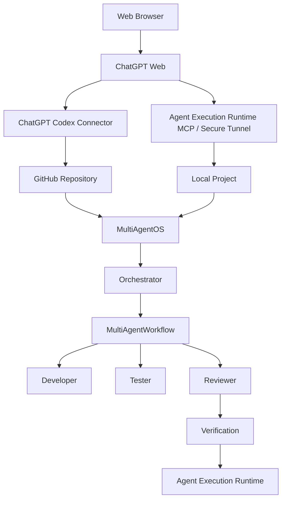
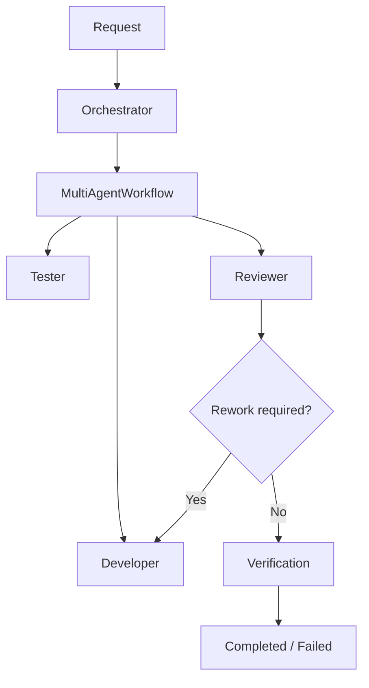
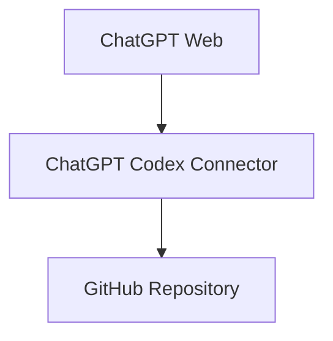
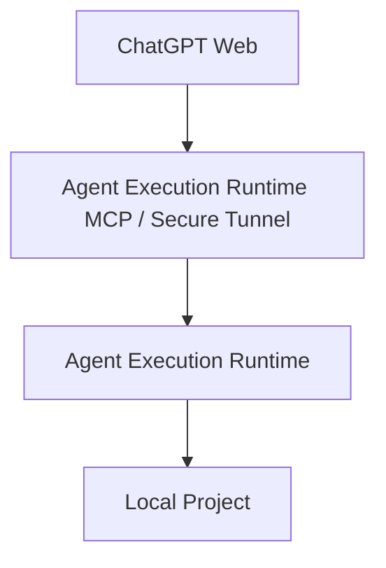

# MultiAgentOS

> **Cost-Free Multi-Agent Development Orchestration**

MultiAgentOS 是以 **Agent Execution Runtime** 为核心的 Local-first AI 开发编排平台。

Cost-Free 基线**不要求单独的付费 AI API Key**。MultiAgentOS 将可用的 AI 客户端、GitHub 和本地项目连接起来，同时把执行权限保持在 Agent Execution Runtime 内部。

## MultiAgentOS 做什么

MultiAgentOS 将**AI 协作**与**执行权限**分离。

- **ChatGPT Web** — 当前验证环境中同时支持 GitHub + 本地 MCP 的开发入口
- **ChatGPT Mobile** — 当前验证环境中仅支持 GitHub 的开发入口
- **ChatGPT Codex Connector** — 远程 GitHub Repository 访问
- **Agent Execution Runtime MCP / Secure Tunnel** — 本地项目连接
- **Orchestrator** — 多智能体协作的顶层协调
- **MultiAgentWorkflow** — Developer → Tester → Reviewer
- **Agent Execution Runtime** — 权限与执行的最终边界

Agent 提供意图、计划和结果，但不直接拥有 filesystem、process、patch、Git 的执行权限。

## ChatGPT 客户端验证范围

当前 MultiAgentOS 开发环境实际验证的连接范围如下：

| 客户端 | GitHub Repository | 本地 MCP | 状态 |
| --- | --- | --- | --- |
| ChatGPT Web | 可以 | 可以 | 已验证 |
| ChatGPT Mobile | 可以 | 不可以 | 已验证 |

> 当前验证环境中，ChatGPT Web 可以同时使用 GitHub 和本地 MCP；ChatGPT Mobile 仅可使用 GitHub 连接。本表记录已验证的组合。

## 架构



### 责任边界

| 组件 | 责任 |
| --- | --- |
| **ChatGPT Web** | 用户入口 |
| **ChatGPT Codex Connector** | 远程 GitHub Repository 访问 |
| **Agent Execution Runtime MCP / Secure Tunnel** | 本地项目连接 |
| **MultiAgentOS** | Agent 合约、路由、状态和编排 |
| **Orchestrator** | 整体协作协调 |
| **MultiAgentWorkflow** | stage、handoff、review、rework 语义 |
| **Agent Execution Runtime** | 权限与执行控制 |

## 多智能体工作流



`Orchestrator.run_workflow()` 是稳定的上层编排入口。`MultiAgentWorkflow` 负责具体的 stage、handoff、review 和 rework 语义，`MultiAgentRuntime` 则作为 application/runtime adapter 使用这一编排边界。

Agent Execution Runtime 是 permission、filesystem、patch、process、Git 和 verification 的执行边界。

## 连接模型

### 远程 GitHub 路径



### 本地项目路径



Agent Execution Runtime **只有一个 MCP Server**。Secure MCP Tunnel 和 `tunnel-client` 是 transport/connection infrastructure，而不是第二个 MCP Server。

本地 Agent Execution Runtime MCP Server 可以在没有 OpenAI、ChatGPT、tunnel 或付费 AI API Key 的情况下独立使用。

## Cost-Free 基线

核心原则很简单：

> **MultiAgentOS 的 Cost-Free 基线不需要单独的付费 AI API Key。**

基本运行时也不要求：

- 单独的 Agent API 订阅
- MultiAgentOS SaaS 订阅
- Tunnel 路径上的第二个 MCP Server

但你所使用的 AI 服务仍然受其产品计划和使用量限制约束。Cost-Free 描述的是 MultiAgentOS 的运行时成本结构，并不意味着 AI 服务可以无限免费使用。

### 已验证的基础能力

- Agent Execution Runtime MCP stdio 初始化和 tool discovery
- filesystem READ / WRITE
- `patch.apply`
- `shell.run`
- local MCP/runtime tests
- runtime health/readiness
- Secure MCP Tunnel readiness

详细记录请参阅 [Cost-Free Development Baseline](docs/COSTFREE_DEVELOPMENT.md)。

## 快速开始

### 安装

```bash
python -m pip install multiagentos
```

### 初始化项目

```bash
cd your-project
multiagentos init . --component all
multiagentos status .
```

### 执行本地任务

```bash
multiagentos run --path . --objective "run tests" -- python -m unittest discover -s tests -v
```

### 启动 Chat Agent 会话

```bash
multiagentos chat --path . --objective "inspect the current project"
```

### 启动 Agent Execution Runtime MCP Server

```bash
multiagentos mcp serve --path .
```

## 配置

项目配置保存在 `.multiagentos/` 下。

初始化可以安装：

- `components.json` — 已选择的组件
- `execution.json` — execution Agent/Model 选择
- `chat.json` — Chat Agent 选择
- `agents.json` — multi-agent catalog
- `state/` 以及必要的 session/checkpoint 数据

Credential 和 provider API key 不会写入项目配置。

## 验证

```bash
python -m unittest discover -s tests -v
```

GitHub Actions 也会通过 CI 验证仓库。

## 文档

- [Getting Started](docs/GETTING_STARTED.md)
- [Cost-Free Development Baseline](docs/COSTFREE_DEVELOPMENT.md)
- [ChatGPT Client Capability Matrix](docs/CHATGPT_CLIENT_CAPABILITIES.md)
- [Agent Execution Runtime Connection Guide](docs/AGENT_EXECUTION_RUNTIME_CONNECTIONS.md)
- [Secure MCP Tunnel Setup](docs/MCP_TUNNEL.md)
- [Agent Execution Runtime GitHub Connection](docs/AGENT_EXECUTION_RUNTIME_GITHUB_CONNECTION.md)
- [Agent Execution Runtime MCP Architecture](docs/ARCHITECTURE_DECISIONS.md)

英文 README 是 canonical technical document。各 locale README 保持相同的架构、术语和 Cost-Free 基线。

**[한국어](README.ko.md) · [English](README.md) · [日本語](README.ja.md)**

## License

请参阅 [LICENSE](LICENSE)。
