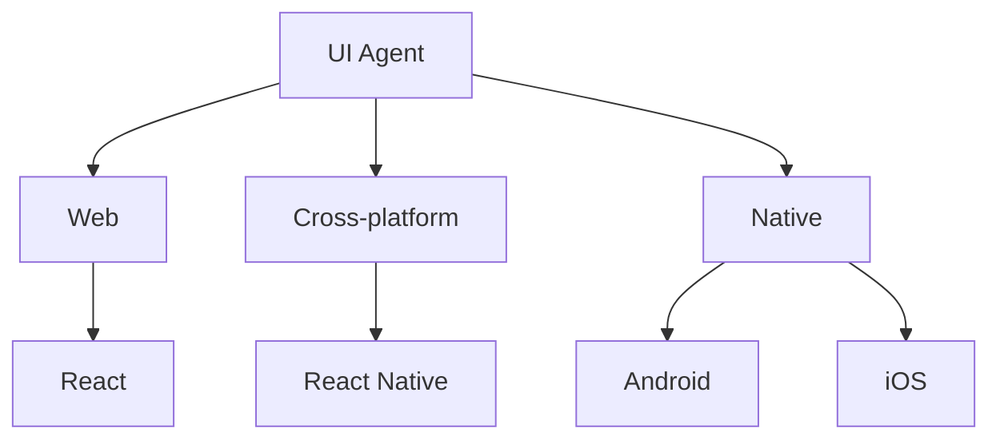

# Agent Taxonomy and Routing

MultiAgentOS uses two orthogonal dimensions:

~~~mermaid
flowchart TB
    TASK["Task"]

    TASK --> GOVERNANCE["Governance / Execution"]
    TASK --> SPECIALIST["Specialist"]

    GOVERNANCE --> FILE["File Picker"]
    GOVERNANCE --> PLAN["Planner"]
    GOVERNANCE --> EDIT["Editor"]
    GOVERNANCE --> EXEC["Executor"]
    GOVERNANCE --> MONITOR["Terminal Monitor"]
    GOVERNANCE --> REVIEW["Reviewer"]
    GOVERNANCE --> DEBUG["Debugger"]
    GOVERNANCE --> BROWSER["Browser Agent"]

    SPECIALIST --> RESEARCH["Research"]
    SPECIALIST --> UI["UI"]
    SPECIALIST --> DEVELOPMENT["Development"]

    RESEARCH --> DEV_RESEARCH["Development Research"]
    RESEARCH --> UI_RESEARCH["UI Research"]

    DEVELOPMENT --> REACT["React"]
    DEVELOPMENT --> RN["React Native"]
    DEVELOPMENT --> ANDROID["Android"]
    DEVELOPMENT --> IOS["iOS"]

    UI --> WEB["Web"]
    UI --> CROSS["Cross-platform"]
    UI --> NATIVE["Native"]

    WEB --> WEB_REACT["React"]
    CROSS --> RN_UI["React Native"]
    NATIVE --> ANDROID_UI["Android"]
    NATIVE --> IOS_UI["iOS"]
~~~

## Platform-oriented research

Development research and UI research are separate because their evidence questions differ.

~~~mermaid
flowchart TB
    RESEARCH["Research"]

    RESEARCH --> DEVELOPMENT["Development Research"]
    DEVELOPMENT --> REACT_R["React"]
    DEVELOPMENT --> RN_R["React Native"]
    DEVELOPMENT --> ANDROID_R["Android"]
    DEVELOPMENT --> IOS_R["iOS"]

    RESEARCH --> UI["UI Research"]
    UI --> WEB_UI["Web UI / React"]
    UI --> RN_UI["React Native UI"]
    UI --> ANDROID_UI["Android UI / Compose"]
    UI --> IOS_UI["iOS UI / SwiftUI"]
~~~

Development research answers questions such as:

- What is the current supported API?
- Which API or library is deprecated?
- What version compatibility constraints exist?
- Which official migration guidance applies?
- What implementation pattern matches the current project?

UI research answers questions such as:

- What is the current platform UI guidance?
- What accessibility and layout rules apply?
- Which framework APIs are current?
- What visual validation should be performed?
- Which platform-specific interaction patterns should be preserved?

## Routing examples

### React development

~~~mermaid
flowchart LR
    TASK["React feature"] --> PLAN["Planner"]
    PLAN --> RESEARCH["React Development Research"]
    RESEARCH --> DEV["React Developer"]
    DEV --> EDIT["Editor"]
    EDIT --> EXEC["Executor"]
    EXEC --> REVIEW["Reviewer"]
~~~

### React Native development

~~~mermaid
flowchart LR
    TASK["React Native feature"] --> PLAN["Planner"]
    PLAN --> RESEARCH["React Native Development Research"]
    RESEARCH --> DEV["React Native Developer"]
    DEV --> EDIT["Editor"]
    EDIT --> EXEC["Executor"]
    EXEC --> REVIEW["Reviewer"]
~~~

### Android UI

~~~mermaid
flowchart LR
    TASK["Android UI"] --> PLAN["Planner"]
    PLAN --> RESEARCH["Android UI Research"]
    RESEARCH --> UI["Android UI Specialist"]
    UI --> EDIT["Editor"]
    EDIT --> EXEC["Executor"]
    EXEC --> TEST["Android UI Test"]
    TEST --> REVIEW["Reviewer"]
~~~

### iOS UI

~~~mermaid
flowchart LR
    TASK["iOS UI"] --> PLAN["Planner"]
    PLAN --> RESEARCH["iOS UI Research"]
    RESEARCH --> UI["iOS UI Specialist"]
    UI --> EDIT["Editor"]
    EDIT --> EXEC["Executor"]
    EXEC --> TEST["iOS UI Test"]
    TEST --> REVIEW["Reviewer"]
~~~

## Runtime route hierarchy

Taxonomy roots are executable routing stages rather than documentation-only labels.

For Android and iOS UI work the runtime route includes `ui-agent -> ui-native -> ui-android/ui-ios`. React Native uses `ui-agent -> ui-react-native`, and Web uses `ui-agent -> ui-web`.

Governance validates the generated route against the requested work type and target before execution. A plan with a mismatched specialist route is rejected at the runtime governance boundary.

## Browser boundary

Browser Agent is not the UI root.

~~~mermaid
flowchart TB
    UI["UI Agent"] --> WEB["Web UI"]
    WEB --> REACT["React"]
    WEB --> BROWSER["Browser Agent"]
    BROWSER --> VISUAL["Visual Validation"]
~~~

This keeps browser interaction as a Web capability while the UI taxonomy remains reusable across Web, React Native, Android, and iOS.

## ChatGPT / Codex boundary

MultiAgentOS does not treat the GitHub connector as an agent.

~~~mermaid
flowchart LR
    USER["User"] --> CHATGPT["ChatGPT"]
    CHATGPT --> CODEX["Codex / Coding Agent"]
    CODEX --> RUNTIME["MultiAgentOS Agent Execution Runtime"]
    RUNTIME --> MCP["MCP"]
    RUNTIME --> TOOLS["Filesystem / Process / Git / GitHub"]
~~~

GitHub connectivity is a repository/tool capability. Codex is the coding-agent client boundary; MultiAgentOS provides the project execution and governance boundary. Current OpenAI documentation describes Codex as the coding agent and distinguishes it from the GitHub connection used to retrieve repository content. citeturn2search1turn2search2
