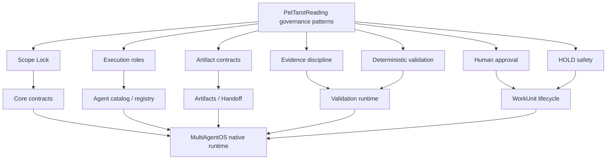
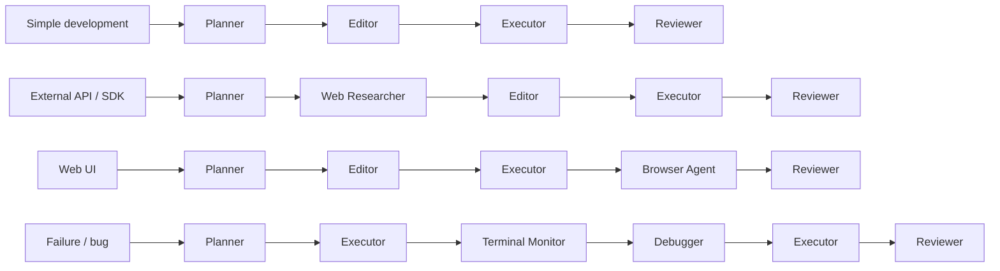
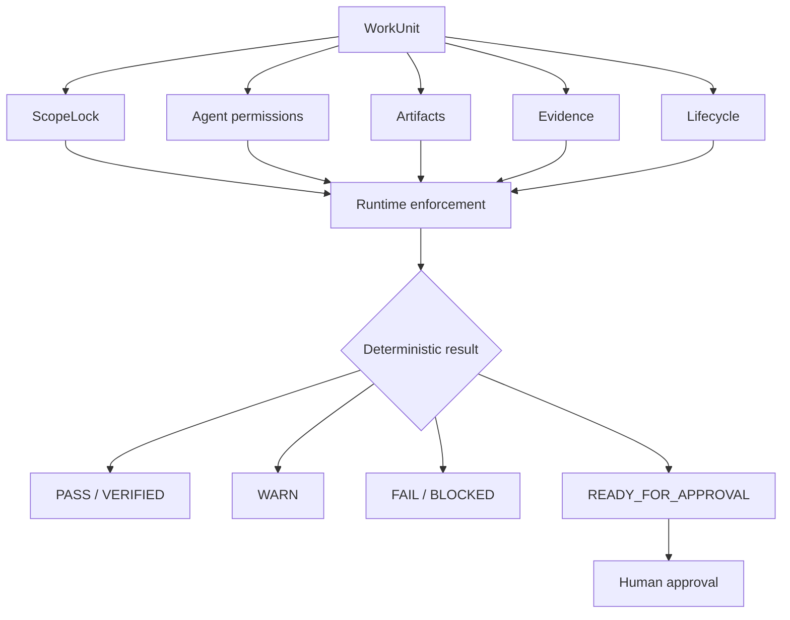

# PetTarotReading Governance Migration

MultiAgentOS absorbs the strongest governance patterns from PetTarotReading without copying its Agent OS runtime.

## Target architecture

## Migration rules

1. MultiAgentOS remains the single execution runtime.
2. PetTarotReading's `.agent-os` directory is not copied.
3. Existing WorkUnit, planning, delegation, orchestration, state, checkpoint, MCP, and model-routing systems remain authoritative.
4. Governance is expressed as provider-neutral Python contracts and runtime checks.
5. Agent roles are catalog entries, not a second orchestration engine.
6. Deterministic validators decide machine-checkable facts; agents provide work and evidence.
7. Release and irreversible actions remain behind explicit human approval.
8. HOLD prevents silent resume, reset, revert, or rewrite.

## Role mapping

| PetTarotReading role | MultiAgentOS role | Primary capability |
| --- | --- | --- |
| File Picker | `file-picker` | discovery |
| Planner | `planner` | planning |
| Web Researcher | `web-researcher` | research |
| Editor | `editor` | bounded editing |
| Executor | `executor` | process / execution |
| Terminal Monitor | `terminal-monitor` | runtime monitoring |
| Reviewer | `reviewer` | review |
| Browser Agent | `browser-agent` | browser validation |
| Debugger | `debugger` | bounded debugging |

The existing MultiAgentOS `tester` and platform specialists remain available; these nine roles add the execution-governance vocabulary rather than replacing existing specialists.

## Smallest-sufficient routing

Routing is a template, not a requirement to invoke every role. The runtime should select the smallest sufficient path.

## Governance boundary

## Implementation order

1. Introduce provider-neutral `ScopeLock` and `EvidenceRecord` contracts.
2. Extend `PlanStep` and `WorkUnit` with bounded scope/governance metadata.
3. Add the nine execution roles to the native Agent catalog.
4. Add HOLD and approval-aware lifecycle guards.
5. Add deterministic scope/evidence validation to the validation runtime.
6. Add routing templates and governance documentation.
7. Update tests and localized architecture documentation.

This order deliberately reuses existing MultiAgentOS approval, artifact, handoff, state, and validation infrastructure instead of creating parallel subsystems.
