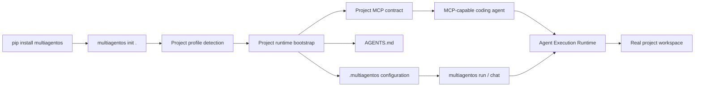
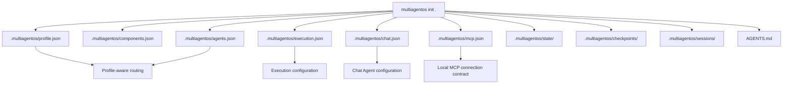
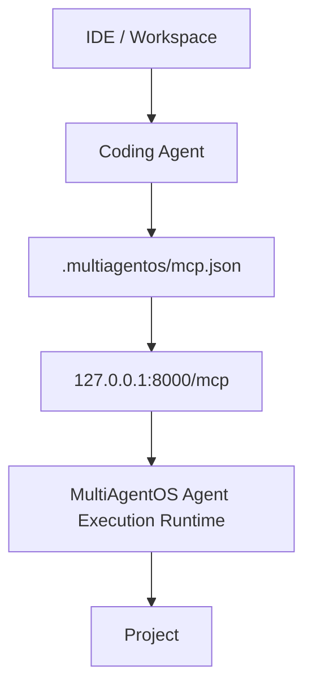
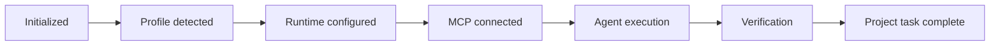
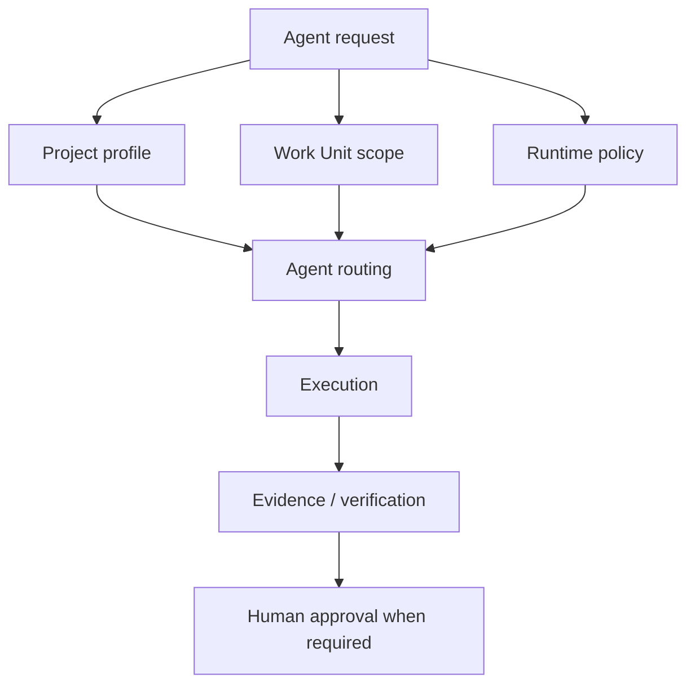

# Project Installation

MultiAgentOS is installed **into a project workspace**, not into an IDE.

The IDE and coding agent remain client/workspace layers. MultiAgentOS provides the project-scoped execution and governance boundary.

## Installation flow



## What multiagentos init creates



Existing AGENTS.md, .multiagentos/mcp.json, and .multiagentos/.gitignore files are preserved on re-initialization.

Runtime state is kept under .multiagentos/state/, .multiagentos/checkpoints/, and .multiagentos/sessions/ and is ignored by the generated runtime-local .gitignore.

## Initialize

From the project root:

```bash
python3 -m pip install "multiagentos[mcp-http]"
multiagentos init .
multiagentos status .
```

The initializer detects the project profile and creates the project-local runtime contract. It does not install an IDE extension, modify IDE settings, start a background service, or require a paid AI API key.

## Runtime connection



The generated MCP contract is client-neutral. Client-specific configuration remains the responsibility of the client and is never generated as an IDE plugin.

Default endpoint:

```text
http://127.0.0.1:8000/mcp
```

The generated configuration starts with read-only capabilities:

- allow_write: false
- allow_process: false

Enable side-effecting capabilities only through an explicit MCP server/service command:

```bash
multiagentos mcp serve-http \
  --path . \
  --allow-write \
  --allow-process
```

## Project lifecycle



The project configuration is durable repository-local metadata. Execution state is local runtime state and must not contain credentials.

## Governance boundary



MultiAgentOS remains the execution and governance authority. A coding agent may reason about the task, but it does not bypass the project runtime boundary.

## Recommended next step

After initialization, connect the project's MCP endpoint to the coding agent and run a **read-only inspection first**. Then enable write/process capabilities when the work unit requires them.

See Getting Started, Agent Taxonomy, and Agent Execution Runtime Connection Guide.
