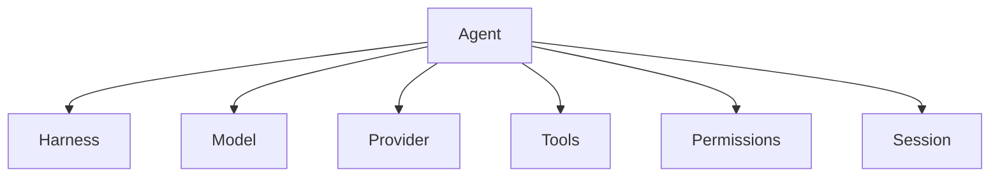

# Agent Execution Runtime Source Capability Inventory

## Purpose

This document records the first implementation-oriented inventory of the three systems that Agent Execution Runtime is intended to absorb:

1. `eaglesjo/free-claude-code` — AI/provider/harness runtime
2. `eaglesjo/luna-chat-coder` — repository continuity/recovery workflow
3. `eaglesjo/chatgpt-local-coder` — local execution/MCP/tool runtime

MultiAgentOS remains the integration base. Multi-Agent orchestration is an extension of Agent Execution Runtime, not the definition of Agent Execution Runtime.

## Source-to-Agent Execution Runtime mapping

| Source | Existing capability | Agent Execution Runtime destination | Action |
|---|---|---|---|
| free-claude-code | provider catalog and credentials | AI Runtime / Provider | generalize |
| free-claude-code | model catalog/capabilities | AI Runtime / Model | generalize |
| free-claude-code | Chat/Responses protocol adaptation | AI Runtime / Protocol | add |
| free-claude-code | tool calling and tool schema handling | Tool Runtime / Protocol | add |
| free-claude-code | reasoning controls | AI Runtime / Reasoning | add |
| free-claude-code | streaming/interleaved events | AI Runtime / Event Stream | add |
| free-claude-code | fallback model routing | AI Runtime / Fallback | add |
| free-claude-code | coding harness launchers | Agent Runtime / Harness | add |
| free-claude-code | browser coding sessions | Session Runtime | add later |
| free-claude-code | IDE/client integrations | Future IDE Adapters | evaluate only after runtime completion |
| luna-chat-coder | exact GitHub source recovery | Repository Runtime | retain/generalize |
| luna-chat-coder | sandbox-first workflow | Execution Policy | generalize |
| luna-chat-coder | durable commit/PR state | Repository Runtime / State | retain |
| luna-chat-coder | bounded Actions missions | CI Runtime | add |
| luna-chat-coder | recovery/continuity | Session + State Runtime | add |
| luna-chat-coder | evidence-bounded completion | Evidence Runtime | add |
| luna-chat-coder | concurrent actor awareness | State/Repository Runtime | add |
| chatgpt-local-coder | filesystem tools | Local Tool Runtime | add |
| chatgpt-local-coder | persistent shell/processes | Local Tool Runtime | add |
| chatgpt-local-coder | Git tools | Local Tool Runtime | extend current GitRuntime |
| chatgpt-local-coder | patch/apply_patch | Local Tool Runtime | add |
| chatgpt-local-coder | path security | Security / Policy | add |
| chatgpt-local-coder | permissions | Security / Policy | add |
| chatgpt-local-coder | checkpoints/rewind | State Runtime | add |
| chatgpt-local-coder | Git snapshots | State/Evidence Runtime | add |
| chatgpt-local-coder | project memory/auto-memory | Project Runtime | add |
| chatgpt-local-coder | activity/audit log | Evidence Runtime | add |
| chatgpt-local-coder | tool profiles/annotations | Tool Runtime | add |
| chatgpt-local-coder | MCP bridge/session/proxy/OAuth | MCP Runtime | add |
| chatgpt-local-coder | post-edit hooks | Validation Runtime | add |
| MultiAgentOS | WorkUnit lifecycle | Agent Execution Runtime Work Runtime | retain |
| MultiAgentOS | provider/model registries | AI Runtime | refactor |
| MultiAgentOS | model adapters | AI Runtime | refactor |
| MultiAgentOS | Project/Agent Profiles | Project Runtime | retain but subordinate |
| MultiAgentOS | delegation/review lifecycle | Multi-Agent Extension | retain |

## Architectural corrections

### 1. Agent is not just Model + Role

The current `AgentContract` is useful but incomplete. A Agent Execution Runtime agent needs explicit runtime bindings:

A model is an inference resource. A harness is an execution/client behavior. They must not be conflated.

### 2. ModelResponse is too narrow

The current `ModelResponse.text` is sufficient for the first adapters but cannot represent tool calls, reasoning events, images, partial streaming, usage, or structured protocol events.

The target runtime therefore needs an event-oriented representation while preserving a simple text response compatibility layer.

### 3. Local execution is a first-class runtime

The current CLI adapter invokes a command, but it does not model the richer local execution surface supplied by chatgpt-local-coder:

- persistent shell state
- background processes
- filesystem operations
- patch application
- Git operations
- path validation
- permission checks
- audit events

These belong under a Agent Execution Runtime Tool Runtime rather than being embedded in individual model adapters.

### 4. Repository state and local state must be distinct

GitHub is durable repository truth. The local workspace is an execution surface. Agent Execution Runtime needs an explicit state boundary so that checkpoints, recovery, and publication can reason about both without treating either as a substitute for the other.

### 5. Multi-Agent sits above the runtime

Planner/Coder/Reviewer delegation should consume Agent Execution Runtime runtime capabilities. It should not own provider, filesystem, MCP, recovery, or GitHub mechanics.

## Capability gaps in the current repository

The current MultiAgentOS baseline does not yet have first-class abstractions for:

- Harness
- Session
- Tool and Tool Registry
- Tool Invocation / Tool Result
- Event Stream
- Protocol Adapter
- Reasoning configuration
- Fallback policy
- Local filesystem runtime
- persistent shell/process runtime
- patch runtime
- permissions/path security
- checkpoint/rewind
- project memory
- activity/audit/evidence
- MCP upstream/session/proxy
- post-edit hooks
- bounded Actions missions
- durable recovery records

## Design rule

Do not copy the source repositories wholesale.

Absorb their stable capabilities into provider-neutral Agent Execution Runtime contracts and runtimes, then delete source-specific assumptions at the Agent Execution Runtime boundary.

## Source-specific licensing/compatibility gate

Before copying implementation code rather than reimplementing behavior, inspect and preserve each source repository's license obligations. The architectural inventory is not permission to transplant incompatible source code.

## Initial implementation order

1. Runtime contracts: Harness, Session, Tool, Event, Protocol.
2. Local Tool Runtime: filesystem, shell/process, Git, patch, permission/path security.
3. AI Runtime: protocol/event stream, tool calling, reasoning and fallback.
4. Repository Runtime: GitHub, recovery, checkpoint, evidence and Actions.
5. MCP Runtime: upstream, session, proxy, OAuth and tool profiles.
6. Validation Runtime: post-edit hooks and validation evidence.
7. Multi-Agent Runtime: planner, delegation, coder, reviewer, handoff and recovery.
8. Only after 1–7: evaluate Xcode/iOS, VS Code and Android Studio plugin/extension adapters.

## Acceptance principle

Every absorbed capability must have:

- a provider/vendor-neutral contract,
- a runtime implementation boundary,
- tests,
- policy/security controls where it can mutate the environment,
- observable evidence where completion depends on it.

