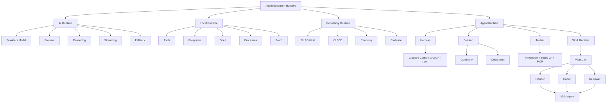
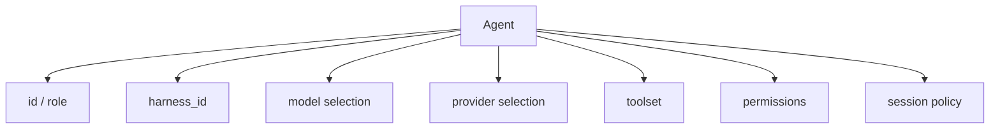
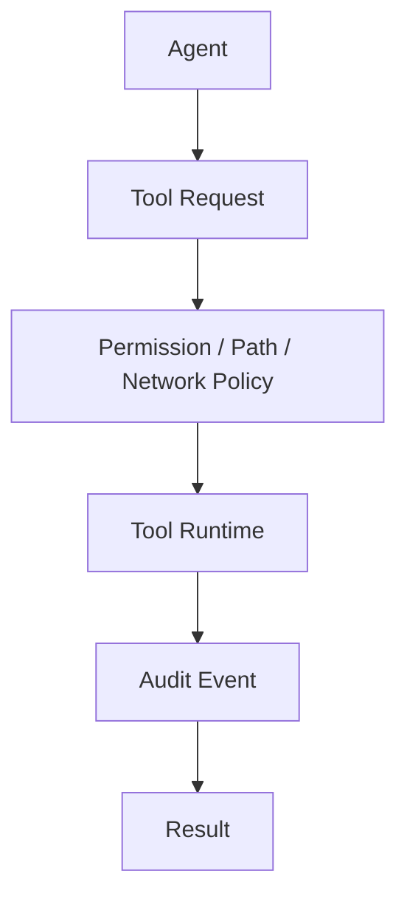
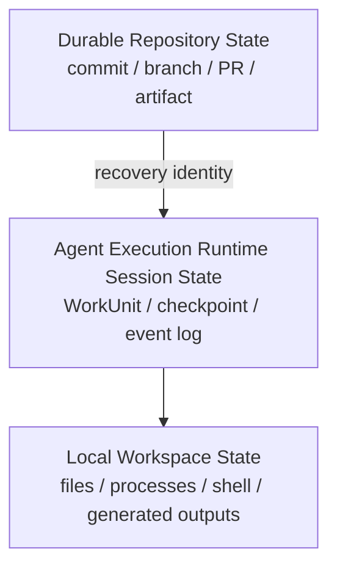
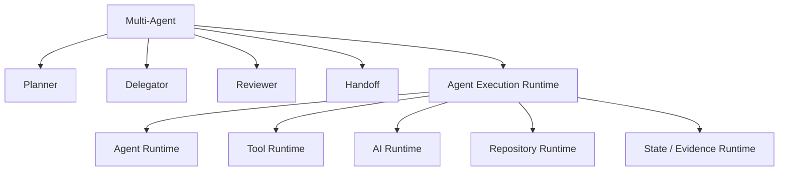

# MultiAgentOS Target Architecture

## Product boundary

The Agent Execution Runtime is the execution boundary used by MultiAgentOS.

Its job is to combine:

- AI model/provider/protocol execution
- coding harness execution
- local machine tooling
- Git/GitHub repository operations
- session continuity and recovery
- security/policy enforcement
- MCP/external tools
- validation/evidence

Multi-Agent is an orchestration extension on top of this runtime.

## Layered architecture



## Core contracts

### Agent

An agent is a runtime identity with execution bindings.



### Harness

A harness describes how an agent performs coding work.

Examples are Claude Code, Codex, ChatGPT-local execution, or a generic CLI harness.

A harness is not a model and is not a provider.

### Session

A session owns continuity for an active development interaction:

- conversation/session identity
- working directory
- selected agent/harness/model
- persistent shell context
- checkpoints
- event history
- recovery identity

### Tool

A Tool is an explicit executable capability with:

- stable ID
- input schema
- output/result schema
- permission requirement
- side-effect classification
- audit metadata

### Event

The AI runtime should emit normalized events instead of forcing all providers into a final text response:

```text
request
delta
reasoning
tool_call
tool_result
message
usage
error
completed
```

A compatibility adapter can still expose `ModelResponse.text` for simple consumers.

### Protocol

A protocol adapter translates between normalized Agent Execution Runtime requests/events and provider/harness wire formats.

This isolates OpenAI Chat/Responses, Anthropic Messages, Gemini, local OpenAI-compatible servers, and future protocols.

## Security boundary

All local and repository mutation passes through policy:



Secrets are referenced by environment/credential handles, never stored in WorkUnit state.

## State boundary



Recovery always prefers exact durable repository identity over conversational reconstruction.

## Multi-Agent boundary

Multi-Agent orchestration consumes Agent Execution Runtime services:



The orchestration layer must not duplicate provider, MCP, filesystem, security, or GitHub implementations.

## Migration strategy

### Phase A — contract foundation

Add provider-neutral contracts without breaking existing APIs:

- `HarnessSpec`
- `SessionSpec`
- `ToolSpec`
- `ToolRequest`
- `ToolResult`
- `RuntimeEvent`
- `ProtocolAdapter`
- `FallbackPolicy`

### Phase B — local tool runtime

Generalize the strongest pieces of chatgpt-local-coder into Agent Execution Runtime:

- path security
- permissions
- filesystem
- shell/process
- patch
- Git
- audit

### Phase C — AI runtime

Generalize free-claude-code:

- protocol adapters
- event/stream model
- tool calling
- reasoning
- model capabilities
- fallback
- harness adapters

### Phase D — repository continuity

Generalize luna-chat-coder:

- exact source identity
- recovery records
- bounded Actions missions
- evidence
- durable handoff
- concurrent state checks

### Phase E — MCP and validation

Add:

- MCP upstream configuration
- MCP sessions/proxy
- OAuth boundary
- tool profiles
- post-edit hooks
- validation evidence

### Phase F — Multi-Agent

Move current planner/delegation/review lifecycle onto the Agent Execution Runtime runtime services.

## Compatibility policy

Existing `ModelSpec`, `ModelAdapter`, `AgentContract`, `WorkUnit`, and `AgentExecutionRuntime` APIs remain usable during migration.

New runtime contracts should be additive first. Removal/renaming happens only after consumers and tests are migrated.

## Definition of Agent Execution Runtime readiness

Agent Execution Runtime is ready for downstream integration when a project can:

1. discover its technology/project profile;
2. select an agent and harness;
3. select or route a model/provider;
4. invoke local tools through policy;
5. operate Git and GitHub through explicit capabilities;
6. preserve session/checkpoint state;
7. recover from exact durable state;
8. stream and audit runtime events;
9. integrate external MCP tools;
10. verify and publish work with evidence;
11. optionally enable Multi-Agent orchestration;
12. only then evaluate IDE-specific adapters for Xcode/iOS, VS Code and Android Studio.

At that point downstream projects become consumers of Agent Execution Runtime rather than defining its architecture.


> **Compatibility note:** this legacy target-architecture filename is retained. The canonical architectural term is **Agent Execution Runtime**; see [Terminology](../TERMINOLOGY.md).
